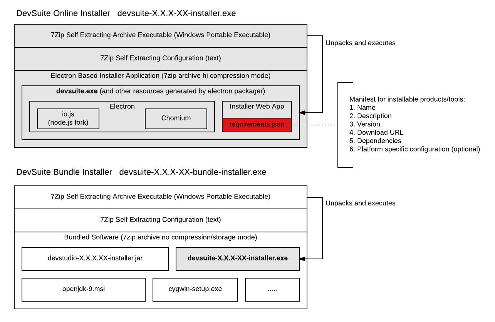

# Installer Packaging

Installer build produces two kinds of platform specific executables:
1. Online Installer - all installed components downloaded during installation
2. Bundle Installer - includes all or some of components

See image below for more detailed information about packaging structure.

